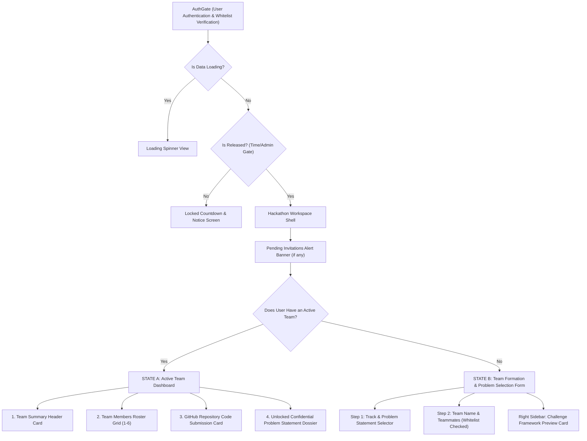

# Qiskit Fall Fest 2026: Flagship Hackathon Master Specification
**IBM Quantum × SRM University-AP · Partner Plus Host**  
*Document Version: 1.0.0 · Comprehensive Event Dossier for PDF Conversion*

---

## Executive Summary

The **Qiskit Fall Fest 2026 Flagship Hackathon** is an elite two-phase quantum computing competition built on the theme of **Algorithm-Architecture Co-Design**. Rather than treating quantum hardware as an abstract, idealized black box, participating teams must formulate, simulate, and benchmark quantum algorithms against concrete physical topologies (Processors A, B, and C) before designing their own custom **12-qubit Processor D** coupling map that directly resolves algorithmic bottlenecks.

This document serves as the master specification containing every track, all 20 technical problem statements, the 100-point evaluation rubric, hardware specifications, and an architectural breakdown of every section in the web application (`/learning/hackathon`).

---

## Table of Contents
1. [Operational Schedule & Hackathon Phases](#1-operational-schedule--hackathon-phases)
2. [Universal Challenge Framework & Hardware Specifications](#2-universal-challenge-framework--hardware-specifications)
3. [The Standard 100-Point Evaluation Rubric](#3-the-standard-100-point-evaluation-rubric)
4. [Submission Repository Structure Requirements](#4-submission-repository-structure-requirements)
5. [Complete Catalog of 5 Domain Tracks & 20 Problem Statements](#5-complete-catalog-of-5-domain-tracks--20-problem-statements)
   - [Track 1: Quantum Chemistry (PS-C1, PS-C2, PS-C3, PS-C-OPEN)](#track-1-quantum-chemistry)
   - [Track 2: Quantum Optimization (PS-O1, PS-O2, PS-O3, PS-O-OPEN)](#track-2-quantum-optimization)
   - [Track 3: Quantum Simulation (PS-S1, PS-S2, PS-S3, PS-S-OPEN)](#track-3-quantum-simulation)
   - [Track 4: Quantum Machine Learning (PS-Q1, PS-Q2, PS-Q3, PS-Q-OPEN)](#track-4-quantum-machine-learning)
   - [Track 5: Post-Quantum Cryptography (PS-P1, PS-P2, PS-P3, PS-P-OPEN)](#track-5-post-quantum-cryptography)
6. [Website & Portal Page Architecture (`/learning/hackathon`)](#6-website--portal-page-architecture-learninghackathon)
7. [Database Schema & Backend API Specifications](#7-database-schema--backend-api-specifications)
8. [Editorial & Customization Guide for Frontend Teams](#8-editorial--customization-guide-for-frontend-teams)

---

## 1. Operational Schedule & Hackathon Phases

| Phase | Designation | Mode | Venue / Platform | Timeline | Key Milestone |
| :--- | :--- | :--- | :--- | :--- | :--- |
| **Phase 1** | Online Sprint | Online | Platform / GitHub | 5 Oct – 13 Oct 2026 | Submissions close 13 Oct, 11:59 PM IST |
| **Jury** | Finalist Selection | Hybrid | Technical Committee | 14 Oct – 16 Oct 2026 | Comprehensive code & rubric audit |
| **Notice** | Finalist Announcement | Online | Web Portal | 17 Oct 2026 | Top 10–12 teams per track qualified |
| **Phase 2** | Onsite Hackathon | In-Person | SRM-AP University Auditorium | 27 Oct – 28 Oct 2026 | 24–26 Hour Overnight Capstone Challenge |
| **Finals** | Pitch & Demonstrations| In-Person | Main Stage Auditorium | 28 Oct 2026 (Evening) | Jury presentations & award distribution |

### Team Composition Rules
- **Team Size:** 1 to 6 members during Phase 1 team formation (1 Leader + up to 5 Teammates).
- **Onsite Finalist Rule:** 2 to 4 members per team for Phase 2 onsite finals.
- **Whitelist Enforcement:** Every teammate's email must be registered on the official portal whitelist.
- **Exclusivity:** A participant can belong to only one team across the entire festival. Once an invitation is accepted, the participant cannot create or join any other team.

---

## 2. Universal Challenge Framework & Hardware Specifications

Every team must evaluate their proposed quantum algorithm across **three standardized quantum hardware backends**, quantifying how topology constraints, native basis gates, and routing inflate circuit depth and degrade physical fidelity:

```
[ Algorithmic Problem ]
         │
         ├───► Benchmark on Processor A (5Q Linear Falcon/Yorktown)
         ├───► Benchmark on Processor B (7Q Heavy-Hex Contemporary)
         └───► Benchmark on Processor C (8-10Q Non-Planar Graph)
         │
         ▼
[ Identify Exact Hardware Bottlenecks (SWAP overhead, degree limits, carry chains) ]
         │
         ▼
[ Propose Custom 12-Qubit Processor D Topology (`processor_D.json`) ]
```

### Standard Hardware Processor Comparison

| Parameter | Processor A | Processor B | Processor C | Processor D (Custom Task) |
| :--- | :--- | :--- | :--- | :--- |
| **Topology Name** | 5-Qubit Linear Chain | 7-Qubit Heavy-Hex | 8–10 Qubit Experimental Graph | Custom Domain-Tailored Graph |
| **Reference Architecture**| IBM Falcon / Yorktown | IBM Heavy-Hex Quantum System | Custom Hyperbolic / 2D Graph | Engineered by Team |
| **Physical Qubit Count** | 5 physical qubits | 7 physical qubits | 8 to 10 physical qubits | **Up to 12 physical qubits** |
| **Coupling Geometry** | 1D line: `(0-1-2-3-4)` | Heavy-hex lattice unit cell | Provided benchmark graph file | Defined via `processor_D.json` |
| **Native Basis Gates** | CX, Rz, SX, X | CX, Rz, SX, X | CX, Rz, SX, X | CX, Single-Qubit Rotations |
| **Nominal 2Q Gate Error**| ~0.5% (Nominal) | ~0.5% (Nominal) | ~0.5% (Nominal) | Bounded by standard baselines |
| **Primary Bottleneck** | $\mathcal{O}(n)$ SWAP chains | Degree-2/3 routing constraints | Non-planar graph embedding | Must eliminate algorithmic SWAPs |

### Processor D Innovation Task Requirements
1. **Qubit Constraint:** Maximum of **12 physical qubits** (indexed `0` to `11`).
2. **Connectivity Freedom:** Any graph topology (planar, non-planar, star, cluster, ring, or tree) explicitly derived from the communication graph of the algorithm.
3. **Artifact Deliverable:** A valid JSON coupling map file named `processor_D.json` containing directed edges, e.g.:
   ```json
   {
     "name": "Processor_D_Quantum_Singularity",
     "num_qubits": 12,
     "coupling_map": [
       [0, 1], [1, 0], [1, 2], [2, 1],
       [0, 3], [3, 0], [2, 4], [4, 2]
     ],
     "basis_gates": ["cx", "rz", "sx", "x"],
     "description": "Star-backbone topology tailored to 4-center electron integrals."
   }
   ```
4. **Engineering Defense:** A written justification demonstrating how Processor D reduces CX gate counts, cuts critical circuit depth, and eliminates SWAP overhead compared to Processors A, B, and C.

---

## 3. The Standard 100-Point Evaluation Rubric

| Component | Weight | Focus Areas | Criteria for Maximum Score |
| :--- | :---: | :--- | :--- |
| **Component A: Core Solution Implementation** | **40 Points** | Mathematical rigor, algorithmic convergence, Qiskit 1.2+ SDK usage | - Correct mathematical formulation & Pauli decomposition<br>- Clean execution with Qiskit Primitives V2 (SamplerV2 / EstimatorV2)<br>- Proven numerical convergence vs exact classical/analytical reference<br>- Error mitigation or noise resilience where applicable |
| **Component B: Architectural Benchmarking** | **30 Points** | Hardware transpilation across Processors A, B, and C | - Empirical transpilation data (depth, CX count, SWAP count)<br>- High-quality comparative visualization plots<br>- Clear scientific explanation of topology trade-offs<br>- Identification of critical hardware bottlenecks |
| **Component C: Custom Processor D Innovation** | **30 Points** | 12-Qubit hardware co-design & validation | - Valid machine-readable `processor_D.json`<br>- Measurable reduction in two-qubit gate depth and zero SWAP insertion<br>- Professional engineering defense explaining graph topology choices |

---

## 4. Submission Repository Structure Requirements

Teams must submit a link to a public repository (GitHub, GitLab, or Hugging Face Space). Submissions must conform to the following directory layout:

```
├── README.md                  # Project overview, team members, track choice, reproduction steps
├── requirements.txt           # Explicit Python library pins (qiskit>=1.2.0, qiskit-aer, numpy, etc.)
├── main.ipynb (or main.py)    # Documented, end-to-end executable notebook generating all reported figures
├── processors/
│   ├── processor_A.json       # 5-Qubit Linear reference coupling map
│   ├── processor_B.json       # 7-Qubit Heavy-Hex reference coupling map
│   ├── processor_C.json       # 8-10 Qubit Experimental Graph coupling map
│   └── processor_D.json       # Custom 12-qubit coupling map engineered by the team
├── results/
│   ├── convergence_plot.png   # Energy / loss / cost function convergence curves
│   ├── hardware_benchmark.png # Depth and CX scaling across Processors A, B, C, and D
│   └── metrics_summary.csv    # Tabulated transpilation counts, depths, and runtimes
└── documentation/
    └── architectural_rationale.pdf # Written engineering defense of Processor D
```

---

## 5. Complete Catalog of 5 Domain Tracks & 20 Problem Statements

---

### Track 1: Quantum Chemistry

#### Problem Statement 1: `PS-C1`
- **Official Title:** H₂ Ground-State Energy Estimation
- **Subtitle:** Variational Quantum Eigensolver in Minimal STO-3G Basis
- **Scientific Objective:** Compute the electronic ground-state energy of the hydrogen molecule ($H_2$) at equilibrium bond distance ($R = 0.735\text{ \AA}$) using the Variational Quantum Eigensolver (VQE). Measure how transpilation onto constrained topologies inflates circuit depth and degrades convergence.
- **Mathematical Formulation:** Second-quantized electronic Hamiltonian:
  $$H = \sum_{pq} h_{pq} a^\dagger_p a_q + \frac{1}{2} \sum_{pqrs} g_{pqrs} a^\dagger_p a^\dagger_r a_s a_q$$
  Mapped via Jordan-Wigner transformation to a 4-qubit Pauli operator:
  $$H = c_0 I + \sum c_i Z_i + \sum c_{ij} Z_i Z_j + \sum c_{ijkl} X_i X_j Y_k Y_l$$
- **Quantum Algorithm & Primitives:** Construct a parameterized trial state $|\psi(\theta)\rangle$ using UCCSD or RealAmplitudes ansatz. Evaluate expectation values $\langle\psi(\theta)|H|\psi(\theta)\rangle$ with Qiskit `EstimatorV2`. Optimize parameters $\theta$ using COBYLA or SPSA.
- **Fixed Hardware Benchmarks:**
  - *Processor A (5Q Linear):* Evaluates routing penalty where qubit 0 and 3 cannot interact directly without intermediate SWAPs.
  - *Processor B (7Q Heavy-Hex):* Evaluates unit cell routing with degree-2/3 constraints.
  - *Processor C (8–10Q Graph):* Custom non-planar embedding.
- **Processor D Task:** Design a 12-qubit Processor D coupling map (`processor_D.json`) that provides direct coupling edges for the dominant two-electron excitation terms in the $H_2$ Hamiltonian, minimizing SWAP overhead to zero.
- **Deliverables:** Executable VQE notebook with EstimatorV2; Convergence plot vs FCI exact ground energy (-1.1373 Hartree); Benchmark comparison table across Processors A, B, and C; `processor_D.json` and engineering justification document.
- **Rubric Breakdown:** Component A: 40 pts (Chemical accuracy $\le 1.6\text{ mHartree}$); Component B: 30 pts (Empirical transpilation metrics & SWAP analysis); Component C: 30 pts (Processor D CX reduction & rationale).

#### Problem Statement 2: `PS-C2`
- **Official Title:** Diatomic Potential Energy Curve Scanning
- **Subtitle:** Full Dissociation Curve of $H_2$ or LiH Across Bond Distances
- **Scientific Objective:** Map the complete potential energy surface (PES) for the dissociation of $H_2$ (or LiH) across internuclear distances from $0.5\text{ \AA}$ to $2.5\text{ \AA}$ in increments of $0.1\text{ \AA}$. Characterize where classical Hartree-Fock breaks down and how quantum circuit depth scales along the curve.
- **Mathematical Formulation:** Compute ground-state energy $E(R)$ as a parametric function of nuclear separation $R$, incorporating nuclear repulsion energy $V_{nn}(R) = \frac{Z_A Z_B}{R}$.
- **Quantum Algorithm & Primitives:** Formulate active space orbital selection using Qiskit Nature. Apply two-qubit reduction (parity mapping + $Z_2$ symmetry tapering) to compress the representation, and evaluate variational convergence across all points.
- **Fixed Hardware Benchmarks:** Measure SWAP routing overhead across varying ansatz parameter profiles on Linear vs Heavy-Hex vs multi-qubit mapping on Processor C.
- **Processor D Task:** Propose a custom 12-qubit Processor D architecture with balanced degree allocation to maintain consistent shallow depth across both equilibrium and dissociated bond geometries.
- **Deliverables:** Automated bond distance loop and PES plot; Comparison against classical exact diagonalization (PySCF or classical FCI reference); Hardware benchmarking data across Processors A, B, and C; `processor_D.json`.
- **Rubric Breakdown:** Component A: 40 pts (PES smoothness & equilibrium bond accuracy); Component B: 30 pts (Circuit depth & two-qubit gate analysis across bond distances); Component C: 30 pts (Processor D topology rationale).

#### Problem Statement 3: `PS-C3`
- **Official Title:** Hardware-Efficient Water Molecule ($H_2O$)
- **Subtitle:** Compact Active Space & Qubit Tapering for Triatomic Systems
- **Scientific Objective:** Simulate the electronic ground state of the water molecule ($H_2O$) by applying active space reduction (freeze-core approximation) and qubit tapering to compress the fermionic space into a compact representation runnable under 8 qubits.
- **Mathematical Formulation:** Full STO-3G water requires 14 spin-orbitals (14 qubits). Frozen core approximation (freezing Oxygen 1s core electrons) + $Z_2$ symmetry tapering compresses active space to 6–8 qubits.
- **Quantum Algorithm & Primitives:** Implement Hardware-Efficient Ansatze (HEA) with alternating $R_y$ and $CZ$ layers. Compare HEA convergence against chemistry-inspired ansatze (UCCSD) under shot noise.
- **Fixed Hardware Benchmarks:** Evaluates routing constraints on 4–5 qubit linear chain vs 6–7 qubit tapered Hamiltonian on Heavy-Hex vs full untapered active space baseline on Processor C.
- **Processor D Task:** Design a 12-qubit Processor D layout with star or cluster interconnects tailored to the triangular geometry and multi-center electron integrals of the $H_2O$ molecule.
- **Deliverables:** Active space transformation and symmetry reduction script in Qiskit Nature; Convergence metrics and energy discrepancy relative to CASCI reference; Benchmarking data tables on Processors A, B, and C; `processor_D.json`.
- **Rubric Breakdown:** Component A: 40 pts (VQE convergence within $5\text{ mHartree}$ of CASCI); Component B: 30 pts (Transpilation analysis comparing HEA vs UCCSD depth); Component C: 30 pts (Processor D triatomic topology).

#### Problem Statement 4: `PS-C-OPEN`
- **Official Title:** Open Innovation: Quantum Molecular Science
- **Subtitle:** Novel Proposals in Excited States, Reaction Barriers, or Solvation
- **Scientific Objective:** Design and validate a novel quantum computational chemistry pipeline targeting excited electronic states (Variational Quantum Deflation - VQD), transition state barriers, or solvated molecular systems.
- **Requirements:** Full molecular specification, basis set, second-quantized Hamiltonian, Qiskit 1.2+ implementation, benchmarking across Processors A, B, and C, and custom Processor D coupling map.
- **Rubric Breakdown:** Component A: 40 pts (Scientific originality & validity); Component B: 30 pts (Standard hardware transpilation benchmarks); Component C: 30 pts (Processor D design quality).

---

### Track 2: Quantum Optimization

#### Problem Statement 5: `PS-O1`
- **Official Title:** Max-Cut on Weighted Graphs
- **Subtitle:** QAOA Circuit Construction & SWAP Bottleneck Analysis
- **Scientific Objective:** Formulate the Maximum Cut (Max-Cut) problem on a non-trivial 6-vertex weighted graph. Implement the Quantum Approximate Optimization Algorithm (QAOA) with depth $p=1$ and $p=2$, and analyze the severe SWAP routing overhead on planar vs non-planar graphs.
- **Mathematical Formulation:** Cost Hamiltonian:
  $$H_C = \sum_{(i,j) \in E} w_{ij} \frac{I - Z_i Z_j}{2}$$
  Transverse mixer Hamiltonian:
  $$H_M = \sum_{i=1}^n X_i$$
- **Quantum Algorithm & Primitives:** Alternating unitary evolution $|\gamma, \beta\rangle = \prod_{k=1}^p [e^{-i \beta_k H_M} e^{-i \gamma_k H_C}] |+\rangle^{\otimes n}$. Optimize $(\gamma, \beta)$ classically using `SamplerV2` to sample cut bitstrings and calculate approximation ratio $\alpha = \frac{C(x)}{C_{max}}$.
- **Fixed Hardware Benchmarks:** Extreme linear SWAP routing overhead vs heavy-hex unit cell mapping vs Processor C non-planar baseline.
- **Processor D Task:** Design a custom 12-qubit Processor D coupling map whose topology is homeomorphic to the communication graph of the problem, eliminating SWAP gates entirely for QAOA layers.
- **Deliverables:** QAOA implementation notebook with graph definition, circuit synthesis, and parameter optimization; Approximation ratio $\alpha$ curve across $p=1, 2$; Transpiled depth, CX counts, and SWAP penalty tables; `processor_D.json`.
- **Rubric Breakdown:** Component A: 40 pts (Correct circuit synthesis, mapping, and convergence); Component B: 30 pts (Two-qubit gate explosion analysis); Component C: 30 pts (Graph-mirroring Processor D).

#### Problem Statement 6: `PS-O2`
- **Official Title:** Constrained Portfolio Selection
- **Subtitle:** Quadratic Unconstrained Binary Optimization (QUBO) with Budget Penalties
- **Scientific Objective:** Formulate a multi-asset Markowitz mean-variance portfolio selection problem as a QUBO. Map asset selection and capital allocation constraints into penalty terms, and solve using QAOA.
- **Mathematical Formulation:** Objective:
  $$\min w^T \Sigma w - q \mu^T w + \lambda \left(\sum w_i - K\right)^2$$
  where $\Sigma$ is the asset covariance matrix, $\mu$ is expected returns, $q$ is risk tolerance, and $\lambda$ is penalty multiplier enforcing budget constraint $K$.
- **Quantum Algorithm & Primitives:** Convert binary asset indicator variables $x_i \in \{0, 1\}$ to Pauli operators via $x_i = \frac{I - Z_i}{2}$. Synthesize all-to-all quadratic interaction terms and evaluate ground-state expectation values.
- **Fixed Hardware Benchmarks:** Linear SWAP scaling for dense covariance matrix interactions vs Heavy-Hex sparse embedding vs Processor C.
- **Processor D Task:** Design a custom 12-qubit Processor D coupling map with a central hub or dense sub-graph to support dense financial covariance interaction terms.
- **Deliverables:** Portfolio QUBO formulation notebook with real/synthetic stock data; Efficient frontier and Sharpe ratio comparison vs classical quadratic solver; Transpilation metrics across A, B, C; `processor_D.json`.
- **Rubric Breakdown:** Component A: 40 pts (QUBO soundness, penalty weight tuning, and valid portfolio selection); Component B: 30 pts (Hardware routing & SWAP analysis); Component C: 30 pts (Dense covariance Processor D).

#### Problem Statement 7: `PS-O3`
- **Official Title:** Combinatorial 0-1 Knapsack Problem
- **Subtitle:** Slack Variable Hamiltonian Mapping & Constraint Verification
- **Scientific Objective:** Implement the NP-hard 0-1 Knapsack problem on a quantum processor using QAOA. Encode inequality capacity constraints using logarithmic slack bit decomposition and benchmark circuit compilation complexity.
- **Mathematical Formulation:** Maximize $\sum v_i x_i$ subject to $\sum w_i x_i \le W$. Introduce integer slack variable $S \in [0, W]$ in binary: $S = \sum_{k=0}^M 2^k y_k$ to convert inequality to equality:
  $$\left(\sum w_i x_i + S - W\right) = 0$$
- **Quantum Algorithm & Primitives:** Penalty Hamiltonian:
  $$H_P = A \left(\sum w_i x_i + \sum 2^k y_k - W\right)^2 - B \sum v_i x_i \quad (A > B)$$
- **Fixed Hardware Benchmarks:** 2 items + 2 slack bits on Processor A; 3 items on Processor B; 4 items on Processor C.
- **Processor D Task:** Design a 12-qubit Processor D coupling map that segregates slack qubits from item decision qubits to minimize cross-register SWAP overhead.
- **Deliverables:** Knapsack Hamiltonian synthesis, slack expansion, and QAOA execution notebook; Probability distribution of valid vs invalid weight configurations; Transpilation benchmarks on A, B, C; `processor_D.json`.
- **Rubric Breakdown:** Component A: 40 pts (Mathematical slack formulation & valid knapsack selection); Component B: 30 pts (Transpilation gate expansion benchmarks); Component C: 30 pts (Slack-segregated Processor D).

#### Problem Statement 8: `PS-O-OPEN`
- **Official Title:** Open Innovation: Quantum Combinatorial Optimization
- **Subtitle:** Industrial Scheduling, Vehicle Routing, or Network Flow
- **Scientific Objective:** Propose and implement a custom industrial combinatorial optimization problem (such as Job Shop Scheduling, Traveling Salesperson, Maximum Independent Set, or Traffic Routing) using QAOA or Quantum Annealing simulation.
- **Rubric Breakdown:** Component A: 40 pts (Originality and mathematical rigor); Component B: 30 pts (Hardware benchmarking across Processors A, B, C); Component C: 30 pts (Processor D optimization).

---

### Track 3: Quantum Simulation

#### Problem Statement 9: `PS-S1`
- **Official Title:** Transverse-Field Ising Model (TFIM) Ground State
- **Subtitle:** Quantum Phase Transitions & Spin Correlation Observables
- **Scientific Objective:** Simulate a 1D chain of interacting quantum spins under the Transverse-Field Ising Model. Characterize the quantum phase transition between the ferromagnetic and paramagnetic phases at critical transverse field strength.
- **Mathematical Formulation:** Hamiltonian:
  $$H = -J \sum_{i=1}^{N-1} Z_i Z_{i+1} - h \sum_{i=1}^N X_i$$
  where $J$ is spin exchange coupling and $h$ is external transverse magnetic field.
- **Quantum Algorithm & Primitives:** Synthesize variational or adiabatic ground-state preparation circuits. Measure average magnetization $\langle M_z \rangle = \frac{1}{N} \sum \langle Z_i \rangle$ and two-point spin correlation functions $\langle Z_i Z_{i+r} \rangle$ as a function of field ratio $h/J$.
- **Fixed Hardware Benchmarks:** Native 1D physical match on Processor A (0 SWAPs for nearest-neighbors) vs 1D chain embedding into 2D Heavy-Hex (Processor B) vs Processor C.
- **Processor D Task:** Design a custom 12-qubit Processor D coupling map featuring periodic boundary conditions (ring topology) or ladder connectivity to simulate closed spin chains with minimal depth.
- **Deliverables:** TFIM simulation notebook with magnetization curve showing phase transition; Verification against exact Jordan-Wigner classical diagonalization; Transpilation metrics across Processors A, B, C; `processor_D.json`.
- **Rubric Breakdown:** Component A: 40 pts (Phase transition detection & correlation measurement); Component B: 30 pts (Linear vs heavy-hex topology trade-off analysis); Component C: 30 pts (Ring/ladder Processor D).

#### Problem Statement 10: `PS-S2`
- **Official Title:** Real-Time Non-Equilibrium Quantum Dynamics
- **Subtitle:** Trotterized Unitary Time Evolution & Dynamical Phase Transitions
- **Scientific Objective:** Simulate the out-of-equilibrium unitary time evolution $|\psi(t)\rangle = e^{-i H t} |\psi(0)\rangle$ following a sudden quantum quench in a spin system. Track the propagation of quantum information (entanglement light cone).
- **Mathematical Formulation:** Decompose time evolution operator $U(t) = e^{-i H t}$ into $M$ discrete Trotter time steps $\Delta t = t/M$ using the first-order Trotter-Suzuki product formula:
  $$e^{-i (H_Z + H_X) \Delta t} \approx \left(e^{-i H_Z \Delta t} e^{-i H_X \Delta t}\right)^M$$
- **Quantum Algorithm & Primitives:** Implement parameterized $R_{zz}$ and $R_x$ gate layers for each Trotter step. Measure Loschmidt echo $L(t) = |\langle\psi(0)|\psi(t)\rangle|^2$ and half-chain entanglement entropy across time.
- **Fixed Hardware Benchmarks:** Depth accumulation across multiple Trotter steps ($M=1..5$) on Processors A, B, and C.
- **Processor D Task:** Design a 12-qubit Processor D coupling map that minimizes the circuit depth of simultaneous two-qubit Trotter blocks through parallel edge activation.
- **Deliverables:** Multi-step Trotterization notebook tracking time-dependent observables; Light-cone information spreading plot or Loschmidt echo verification; Transpilation comparison across Trotter steps $M=1..5$; `processor_D.json`.
- **Rubric Breakdown:** Component A: 40 pts (Numerical stability & observable tracking); Component B: 30 pts (Circuit depth scaling analysis across Trotter steps); Component C: 30 pts (Parallel edge Processor D).

#### Problem Statement 11: `PS-S3`
- **Official Title:** Trotter Error vs Realistic Device Noise Trade-offs
- **Subtitle:** Algorithmic Discretization Error vs Physical Decoherence
- **Scientific Objective:** Investigate the fundamental tension in quantum simulation: increasing Trotter steps reduces mathematical discretization error ($\mathcal{O}(\Delta t^2)$) but increases physical circuit depth, exposing the state to decoherence and gate noise.
- **Mathematical Formulation:** Analyze bound on total simulation error:
  $$\epsilon_{\text{total}} \le \epsilon_{\text{Trotter}}(M) + \epsilon_{\text{hardware}}(D(M))$$
  where $D(M)$ is the two-qubit gate depth as a function of Trotter steps $M$.
- **Quantum Algorithm & Primitives:** Simulate unitary dynamics with both ideal statevector execution and noisy Aer simulation incorporating depolarizing and thermal relaxation noise models.
- **Fixed Hardware Benchmarks:** Identifies sweet-spot Trotter step count $M^*$ on Linear vs Heavy-Hex vs Processor C.
- **Processor D Task:** Design a 12-qubit Processor D coupling map specifically optimized to shift the optimal Trotter step threshold to deeper circuits by reducing SWAP gate insertion.
- **Deliverables:** Simulation notebook with noise model configuration and observable fidelity curves; Trotter error vs hardware noise trade-off plot identifying empirical optimal step count $M^*$; Transpilation tables on A, B, C; `processor_D.json`.
- **Rubric Breakdown:** Component A: 40 pts (Error bounds & realistic noise model configuration); Component B: 30 pts (Empirical identification of $M^*$ across processors); Component C: 30 pts (Noise-resilient Processor D).

#### Problem Statement 12: `PS-S-OPEN`
- **Official Title:** Open Innovation: Quantum Many-Body Simulation
- **Subtitle:** Lattice Gauge Theories, Topological Matter, or Floquet Systems
- **Scientific Objective:** Formulate and execute a novel simulation of an advanced quantum physics model (such as the Fermi-Hubbard model, Kitaev honeycomb lattice, $Z_2$ lattice gauge theory, or periodically driven Floquet systems).
- **Rubric Breakdown:** Component A: 40 pts (Scientific depth, formulation validity, and reproducibility); Component B: 30 pts (Transpilation benchmarking on A, B, C); Component C: 30 pts (Custom lattice Processor D).

---

### Track 4: Quantum Machine Learning

#### Problem Statement 13: `PS-Q1`
- **Official Title:** Biomedical Signal Classifier
- **Subtitle:** Variational Quantum Classification for Arrhythmia & Biosignals
- **Scientific Objective:** Construct a Variational Quantum Classifier (VQC) to classify biomedical signals (such as MIT-BIH ECG heartbeat arrhythmia or EEG seizure detection) into diagnostic categories using parameterized quantum circuits.
- **Mathematical Formulation:** Preprocess multi-channel biosignal data using wavelet transforms or PCA to reduce dimensionality to 4–6 salient features. Map features into Hilbert space via angle or amplitude encoding.
- **Quantum Algorithm & Primitives:** Construct a trainable ansatz $|\psi(x, \theta)\rangle = W(\theta) U(x) |0\rangle^{\otimes n}$. Compute predictions via Pauli-Z expectation values evaluated with `EstimatorV2`. Train using cross-entropy loss and gradient descent.
- **Fixed Hardware Benchmarks:** Training runtime under linear SWAP overhead vs 6-feature Heavy-Hex embedding vs multi-channel input on Processor C.
- **Processor D Task:** Design a 12-qubit Processor D coupling map with low-diameter connectivity that minimizes ansatz depth per training epoch.
- **Deliverables:** End-to-end classification notebook (preprocessing, training, confusion matrix); Accuracy, F1-score, and ROC curve vs classical SVM/Random Forest baseline; Transpilation metrics across A, B, C; `processor_D.json`.
- **Rubric Breakdown:** Component A: 40 pts (Preprocessing rigor, VQC convergence, and classification accuracy); Component B: 30 pts (Transpilation depth & gate benchmarks); Component C: 30 pts (Low-diameter Processor D).

#### Problem Statement 14: `PS-Q2`
- **Official Title:** High-Dimensional Quantum Kernel Classifier
- **Subtitle:** ZZFeatureMap Support Vector Machine (QSVC) on Benchmark Data
- **Scientific Objective:** Implement a Quantum Support Vector Classifier (QSVC) using non-linear quantum kernels generated by ZZFeatureMaps. Evaluate kernel matrix computation overhead and investigate quantum advantage over classical RBF kernels.
- **Mathematical Formulation:** Evaluate kernel Gram matrix:
  $$K_{ij} = |\langle 0| U^\dagger(x_j) U(x_i) |0\rangle|^2$$
  Train classical dual SVM:
  $$\max_\alpha \sum \alpha_i - \frac{1}{2} \sum \alpha_i \alpha_j y_i y_j K_{ij}$$
- **Quantum Algorithm & Primitives:** Construct `ZZFeatureMap` circuits with repetition depth $d=2$. Measure transition probabilities with `SamplerV2` to populate Gram matrices.
- **Fixed Hardware Benchmarks:** Quadratic SWAP penalty for all-to-all entangling blocks in `ZZFeatureMap` on Linear vs Heavy-Hex vs Processor C.
- **Processor D Task:** Design a custom 12-qubit Processor D coupling map that natively matches the pairwise interaction graph of the chosen feature map, eliminating SWAP gates.
- **Deliverables:** Quantum kernel Gram matrix computation notebook + QSVC training; Accuracy and geometric margin comparison vs classical Gaussian RBF kernel; Transpilation benchmarks on A, B, C; `processor_D.json`.
- **Rubric Breakdown:** Component A: 40 pts (Kernel calculation correctness & alignment metrics); Component B: 30 pts (ZZFeatureMap routing benchmarks); Component C: 30 pts (Feature-matched Processor D).

#### Problem Statement 15: `PS-Q3`
- **Official Title:** Noise-Resilient Quantum Classifier with Error Mitigation
- **Subtitle:** Zero-Noise Extrapolation (ZNE) & Readout Mitigation in QML
- **Scientific Objective:** Build a robust variational quantum classifier that maintains high classification accuracy in the presence of realistic device gate noise. Implement Zero-Noise Extrapolation (ZNE) and readout error mitigation to protect model predictions.
- **Mathematical Formulation:** Model device noise with Pauli depolarizing channels and amplitude damping. Apply unitary folding to scale noise factor $\lambda \in \{1, 3, 5\}$, extrapolating to $\lambda \to 0$.
- **Quantum Algorithm & Primitives:** Integrate Qiskit Runtime primitives error mitigation options (ZNE and TREX) into the classifier inference pipeline.
- **Fixed Hardware Benchmarks:** Accuracy degradation under linear SWAP chains vs heavy-hex layout vs Processor C.
- **Processor D Task:** Design a custom 12-qubit Processor D coupling map that minimizes critical circuit depth to stay within device coherence limits.
- **Deliverables:** Classification notebook demonstrating unmitigated vs mitigated model inference accuracy under noise; Zero-noise extrapolation curves; Transpilation metrics for Processors A, B, and C; `processor_D.json`.
- **Rubric Breakdown:** Component A: 40 pts (Demonstrated accuracy recovery under noise); Component B: 30 pts (Hardware transpilation and SWAP analysis); Component C: 30 pts (Noise-minimizing Processor D).

#### Problem Statement 16: `PS-Q-OPEN`
- **Official Title:** Open Innovation: Quantum Machine Learning Frontiers
- **Subtitle:** Quantum GANs, Quantum Autoencoders, or Graph Neural Networks
- **Scientific Objective:** Develop and validate an advanced QML architecture such as a Quantum Generative Adversarial Network (Q-GAN), Quantum Convolutional Neural Network (QCNN), or Quantum Autoencoder for state compression using Primitives V2.
- **Rubric Breakdown:** Component A: 40 pts (Originality, theoretical rigor, and convergence demonstration); Component B: 30 pts (Transpilation analysis across standard processors); Component C: 30 pts (Generative/convolutional Processor D).

---

### Track 5: Post-Quantum Cryptography

#### Problem Statement 17: `PS-P1`
- **Official Title:** Quantum-Safe Secure Communication Channel
- **Subtitle:** Hybrid Classical-Post-Quantum Ephemeral Key Exchange
- **Scientific Objective:** Architect a quantum-resistant cryptographic key exchange channel combining classical Elliptic Curve Diffie-Hellman (ECDH) with the NIST FIPS 203 ML-KEM (Kyber) standard. Implement simulated quantum cryptanalysis attacks against the classical component.
- **Mathematical Formulation:** Hybrid shared secret derivation:
  $$K = \text{KDF}(SS_{\text{ECDH}} \parallel SS_{\text{ML-KEM}})$$
  Demonstrate that compromise of classical discrete logarithm via Shor's algorithm leaves the hybrid key secure due to the hardness of Learning With Errors (LWE).
- **Quantum Algorithm & Primitives:** Construct a toy quantum period-finding circuit in Qiskit simulating the core Shor step that threatens ECDH, and analyze why lattice problems lack periodic structure exploitable by the Quantum Fourier Transform (QFT).
- **Fixed Hardware Benchmarks:** Routing overhead for reversible modular arithmetic components on Linear vs Heavy-Hex vs Processor C.
- **Processor D Task:** Design a 12-qubit Processor D coupling map optimized for reversible modular arithmetic and carry propagation.
- **Deliverables:** End-to-end Python/Qiskit implementation of hybrid key exchange protocol with verification tests; Order-finding circuit implementation on toy modulus; Transpilation benchmarking tables; `processor_D.json` + security report.
- **Rubric Breakdown:** Component A: 40 pts (Protocol correctness, security analysis vs quantum threats, and toy Shor circuit); Component B: 30 pts (Transpilation & SWAP overhead of reversible arithmetic); Component C: 30 pts (Modular arithmetic Processor D).

#### Problem Statement 18: `PS-P2`
- **Official Title:** Enterprise Cryptographic Inventory & Migration Framework
- **Subtitle:** NIST PQC Migration Readiness & Quantum Vulnerability Scoring
- **Scientific Objective:** Develop an automated cryptographic asset discovery and vulnerability assessment framework. Scan network certificates, TLS configurations, and codebases to classify algorithms by quantum risk and generate a structured migration roadmap to ML-KEM and ML-DSA.
- **Mathematical Formulation:** Formulate quantitative Quantum Risk Score:
  $$QRS = f(\text{Data Shelf Life}, \text{Migration Horizon}, \text{Security Margin}, \text{Key Size})$$
  Calculate time-to-quantum-compromise using Mosca's Theorem ($X + Y > Z$).
- **Quantum Algorithm & Primitives:** Model quantum resource estimation (physical qubits, T-gate count, surface code cycles) required to break each discovered classical key size (RSA-2048, ECDSA P-256) on realistic fault-tolerant architectures.
- **Fixed Hardware Benchmarks:** Resource estimation mapping on Processors A, B, and C.
- **Processor D Task:** Propose a custom 12-qubit Processor D coupling map designed as a fault-tolerant logical patch emulator with low routing latency for syndrome extraction.
- **Deliverables:** Executable Python discovery and risk-scoring tool with sample certificates/keys; Structured migration roadmap to FIPS 203 (ML-KEM) and FIPS 204 (ML-DSA); Hardware transpilation analysis; `processor_D.json`.
- **Rubric Breakdown:** Component A: 40 pts (Practical utility, scoring accuracy, and completeness of migration roadmap); Component B: 30 pts (Resource estimation modeling & hardware routing analysis); Component C: 30 pts (Fault-tolerant emulator Processor D).

#### Problem Statement 19: `PS-P3`
- **Official Title:** Reversible Quantum Arithmetic & Carry-Chain Bottlenecks
- **Subtitle:** Hardware Routing Benchmark of Quantum Modular Adders & Multipliers
- **Scientific Objective:** Synthesize and benchmark reversible quantum arithmetic circuits (Cuccaro carry-ripple adders, modular multipliers) that form the core computational engine of Shor's algorithm. Quantify how sequential carry chains inflate SWAP overhead on planar topologies.
- **Mathematical Formulation:** Implement reversible in-place addition:
  $$|a\rangle |b\rangle \to |a\rangle |a + b \pmod{2^n}\rangle$$
  using Toffoli (CCX), CNOT, and Pauli-X gates with minimal ancilla footprint.
- **Quantum Algorithm & Primitives:** Compile multi-bit quantum adders and modular exponentiation circuits onto physical backends. Measure the dramatic difference in SWAP insertion penalty between linear, heavy-hex, and tree topologies.
- **Fixed Hardware Benchmarks:** Linear carry-chain SWAP penalties on Processor A vs carry propagation on degree-2/3 unit cells (Processor B) vs Processor C.
- **Processor D Task:** Design a custom 12-qubit Processor D coupling map featuring a dedicated carry-lookahead backbone that reduces carry propagation depth from $\mathcal{O}(n)$ to $\mathcal{O}(\log n)$.
- **Deliverables:** Notebook synthesizing reversible quantum adders and modular multiplication circuits; Empirical scaling plot showing CX count and depth vs bit length $n$; Transpilation tables on A, B, C; `processor_D.json` + carry-lookahead report.
- **Rubric Breakdown:** Component A: 40 pts (Functional correctness, zero state corruption, and ancilla uncomputation); Component B: 30 pts (Carry-chain routing bottleneck analysis across backends); Component C: 30 pts (Carry-lookahead Processor D).

#### Problem Statement 20: `PS-P-OPEN`
- **Official Title:** Open Innovation: Post-Quantum Cryptographic Systems
- **Subtitle:** Lattice Cryptanalysis, Fault Resistance, or Quantum Hash Functions
- **Scientific Objective:** Propose and evaluate an advanced post-quantum cryptographic mechanism (such as quantum random number generation, lattice basis reduction analysis via quantum algorithms, side-channel analysis of PQC implementations, or quantum-safe zero-knowledge proofs).
- **Rubric Breakdown:** Component A: 40 pts (Novelty, cryptographic soundness, and experimental execution); Component B: 30 pts (Transpilation analysis across standard processors); Component C: 30 pts (Processor D optimization).

---

## 6. Website & Portal Page Architecture (`/learning/hackathon`)

The web interface located at [`app/learning/hackathon/page.tsx`](file:///Users/b.jessyrobert/Desktop/QisKit-Fall-Fest-2026/app/learning/hackathon/page.tsx) is divided into **four structural gates/states**:



### Complete Section Hierarchy

#### 1. Security & Lifecycle Gates
- **`AuthGate`:** Wraps the entire workspace. Ensures the user is signed in with a whitelisted email. Unauthenticated users are redirected to Google OAuth.
- **`Loading State`:** Renders a clean centered burgundy spinner while fetching `/api/hackathon/team`.
- **`Release Gate`:** Locked state before release date (10 October 2026 at 12:00 AM IST). Features a `Lock` icon, countdown copy, and an admin config override check (`/api/admin/config`).

#### 2. Workspace Navigation & Banner
- **Phase Tag:** Burgundy badge with `"PHASE 1 SPRINT"`.
- **Timeline Subtitle:** `"Releases 10 October 2026 · Algorithm-Architecture Co-Design"`.
- **Title & Description:** High-density header explaining team formation, track selection, and the Processor D co-design challenge.

#### 3. Pending Team Invitations Alert Banner
- Appears whenever `pendingInvitations.length > 0`.
- Renders dual-action cards for each team that invited the user.
- Shows Team Name, Lead Name, Lead Email, Track, and Selected PS ID.
- Features `Accept Invitation` (confirms team membership and locks user) and `Decline` buttons.

#### 4. State A: Active Team Dashboard (User is in a team)
1. **Team Summary Header Card:**
   - Displays Team Name, Track, Selected PS ID badge, and Emerald confirmation badge (`CheckCircle2`).
2. **Team Members Roster Grid (1–6 Members):**
   - Renders a 3-column card grid showing each member's Full Name, Role badge (`leader` or `member`), Email, and Confirmation Status (`confirmed`, `invited`, or `declined`).
3. **GitHub Repository Code Submission Card:**
   - Explains required repository contents (`main.ipynb`, `processors/processor_D.json`, `results/`).
   - Interactive URL input with `Submit Repository` / `Update Repository Link`.
   - Real-time success/error alerts and an active submission link pill.
4. **Unlocked Problem Statement Dossier (`<ProblemStatementDossier>`):**
   - Unlocks the confidential technical dossier for `team.problem_statement_id`.

#### 5. State B: Team Formation & Problem Selection Form (User is not in a team)
1. **Step 1: Choose Domain Track & Problem Statement:**
   - **Track Dropdown:** Switches between all 5 verticals.
   - **Problem Statement Radio Cards:** 4 interactive selectable cards per vertical (3 standard + 1 Open Innovation). Each card displays the PS ID, problem title, and subtitle.
2. **Step 2: Team Name & Members (1–6 Members):**
   - **Team Name Input:** Global uniqueness check; minimum 3 characters.
   - **Leader Badge Card:** Auto-populated with the logged-in user's name and email as confirmed leader.
   - **Additional Teammates Input (`<TeammateInput>`):** Up to 5 additional members. Features debounced real-time validation against `/api/auth/verify-email`. Displays status pills: *Verified*, *Not Found in Whitelist*, or *Already in Team*.
   - **Action Button:** Full-width Burgundy button: `"Confirm Team & Unlock [PS-ID] Dossier"`.
3. **Right Sidebar: Challenge Framework Preview Card:**
   - Summarizes 40/30/30 rubric, confidentiality, teammate acceptance rules, and mandatory deliverables checklist.

---

## 7. Database Schema & Backend API Specifications

### Database Schema (Supabase PostgreSQL)
*Migration: `supabase/migrations/20260929214500_create_learning_and_hackathon_platform.sql`*

#### Table: `hackathon_teams`
| Column | Type | Constraints | Description |
| :--- | :--- | :--- | :--- |
| `id` | UUID | PRIMARY KEY, DEFAULT `gen_random_uuid()` | Unique team ID |
| `name` | TEXT | UNIQUE, NOT NULL | Globally unique team name |
| `lead_email` | TEXT | NOT NULL | Email of the team creator |
| `lead_name` | TEXT | NOT NULL | Full name of the team creator |
| `vertical` | TEXT | NOT NULL | Selected domain vertical |
| `problem_statement_id` | TEXT | NOT NULL | Selected PS ID (e.g. `PS-C1`) |
| `github_repo_url` | TEXT | NULLABLE | Submitted repository link |
| `submission_notes` | TEXT | NULLABLE | Participant notes |
| `submitted_at` | TIMESTAMPTZ | NULLABLE | Timestamp of code submission |
| `created_at` | TIMESTAMPTZ | DEFAULT `NOW()` | Team creation timestamp |

#### Table: `team_members`
| Column | Type | Constraints | Description |
| :--- | :--- | :--- | :--- |
| `id` | UUID | PRIMARY KEY, DEFAULT `gen_random_uuid()` | Unique member record ID |
| `team_id` | UUID | REFERENCES `hackathon_teams(id)` ON DELETE CASCADE | Parent team |
| `email` | TEXT | NOT NULL | Member email |
| `full_name` | TEXT | NOT NULL | Member full name |
| `role` | TEXT | `'leader'` or `'member'` | Membership role |
| `status` | TEXT | `'invited'`, `'accepted'`, or `'declined'` | Invitation status |
| `invited_at` | TIMESTAMPTZ | DEFAULT `NOW()` | Invitation timestamp |
| `responded_at` | TIMESTAMPTZ | NULLABLE | Response timestamp |

### API Endpoints
- **`GET /api/hackathon/team`**: Fetches active team data, members, and pending invitations for the authenticated user. Uses Cache-Aside with Upstash Redis (5-min TTL).
- **`POST /api/hackathon/team`**: Validates team name uniqueness, verifies teammate whitelists, inserts team into `hackathon_teams`, and creates `team_members` entries.
- **`POST /api/hackathon/invite-respond`**: Accepts or declines team invitations (`action: 'accept' | 'decline'`).
- **`POST /api/hackathon/submit-repo`**: Records or updates the team's public GitHub URL and submission notes.

---

## 8. Editorial & Customization Guide for Frontend Teams

To customize, restyle, or expand any section of the Hackathon platform, reference the specific files below:

| What to Edit | Target Source File | Notes & Recommendations |
| :--- | :--- | :--- |
| **All 20 Problem Statements** | [`data/learning/problem-statements.ts`](file:///Users/b.jessyrobert/Desktop/QisKit-Fall-Fest-2026/data/learning/problem-statements.ts) | Modify text, formulas, hardware specs, deliverables, or rubrics. |
| **Domain Verticals List** | [`data/learning/types.ts`](file:///Users/b.jessyrobert/Desktop/QisKit-Fall-Fest-2026/data/learning/types.ts) | Update `VerticalType` union if adding or renaming domain tracks. |
| **Workspace Page Layout & Forms** | [`app/learning/hackathon/page.tsx`](file:///Users/b.jessyrobert/Desktop/QisKit-Fall-Fest-2026/app/learning/hackathon/page.tsx) | Edit team formation inputs, release gate countdown, or submission forms. |
| **Dossier Viewer Component** | [`components/learning/ProblemStatementDossier.tsx`](file:///Users/b.jessyrobert/Desktop/QisKit-Fall-Fest-2026/components/learning/ProblemStatementDossier.tsx) | Customize the styling and layout of the confidential problem dossier. |
| **Teammate Whitelist Input** | [`components/learning/TeammateInput.tsx`](file:///Users/b.jessyrobert/Desktop/QisKit-Fall-Fest-2026/components/learning/TeammateInput.tsx) | Customize debounce interval, validation status badges, or member row styling. |
| **Challenge Framework Markdown** | [`public/docs/hackathon-challenge-framework.md`](file:///Users/b.jessyrobert/Desktop/QisKit-Fall-Fest-2026/public/docs/hackathon-challenge-framework.md) | Official downloadable markdown documentation. |
| **Event Directory Cards** | [`data/experience-events.ts`](file:///Users/b.jessyrobert/Desktop/QisKit-Fall-Fest-2026/data/experience-events.ts) | Modify public `/experience` directory cards (`build-01`, `build-05`). |
| **Festival Schedules** | [`data/onlineSchedule.ts`](file:///Users/b.jessyrobert/Desktop/QisKit-Fall-Fest-2026/data/onlineSchedule.ts) & [`data/offlineSchedule.ts`](file:///Users/b.jessyrobert/Desktop/QisKit-Fall-Fest-2026/data/offlineSchedule.ts) | Update hackathon problem release time, ideation sprints, and pitch timings. |
| **Team Organogram Roles** | [`components/team/flowchart-roster-data.ts`](file:///Users/b.jessyrobert/Desktop/QisKit-Fall-Fest-2026/components/team/flowchart-roster-data.ts) | Edit Cell 02 Hackathon student chairs, problem leads, and jury members. |

---
*Generated for Qiskit Fall Fest 2026 · SRM University-AP Department of Physics & Computer Science*
