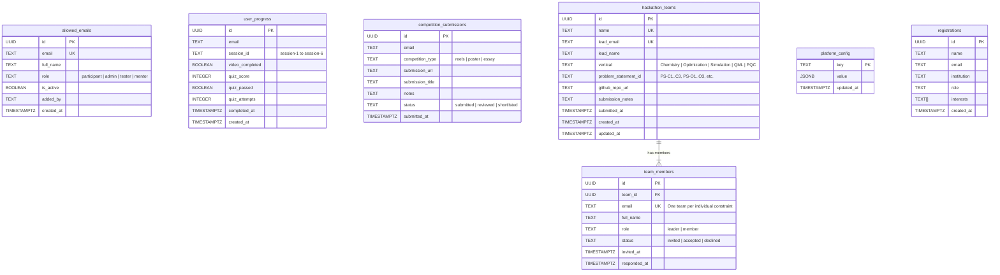

# DATABASE SCHEMA & STORAGE REFERENCE: SUPABASE & UPSTASH REDIS

**Platform:** Qiskit Fall Fest 2026 — SRM University-AP × IBM Quantum  
**Supabase Project ID:** `jpciyrodeppqpkwqblpk`  
**Database Engine:** PostgreSQL 17.6.1  
**Cache Cluster:** Upstash Redis (`grown-shrimp-319291.upstash.io`)  
**Document Status:** Master Database Reference for AI Agents & Engineers  
**Migration Directory:** [`supabase/migrations/`](../supabase/migrations/)  

---

## 1. Architectural Overview & Context

This database powers the complete online phase for Qiskit Fall Fest 2026, comprising:
1. **Access Control & Whitelist:** Enforcing registered Gmail access and administrator management.
2. **Online Masterclass Learning:** Sequential progression across 6 sessions and concept check quizzes.
3. **Daily Creative Competitions:** Submissions for Quantum Tech Reels, Digital Posters, and Essays.
4. **Flagship Hackathon Workspace:** 1–6 member team formation, unique team names, teammate invitation lifecycle, isolated 20-problem-statement dossier viewing, and GitHub repository code submissions.
5. **High-Speed Redis Caching:** Low-latency validation for real-time teammate email lookups and whitelist authorization.

---

## 2. Entity-Relationship (ER) Diagram

---

## 3. Data Dictionary & Table Definitions

### 3.1 `public.allowed_emails`
Stores whitelisted participant, administrator, and tester emails. Checked on login and during real-time teammate selection.

| Column | Type | Constraints | Description |
| :--- | :--- | :--- | :--- |
| `id` | `UUID` | `PRIMARY KEY DEFAULT gen_random_uuid()` | Unique record identifier. |
| `email` | `TEXT` | `UNIQUE NOT NULL` | Lowercase email address. |
| `full_name` | `TEXT` | `NULLABLE` | Participant or administrator full name. |
| `role` | `TEXT` | `DEFAULT 'participant'` | Role: `'participant'`, `'admin'`, `'tester'`, `'mentor'`. |
| `is_active` | `BOOLEAN` | `DEFAULT true` | If false, access is revoked. |
| `added_by` | `TEXT` | `DEFAULT 'admin'` | Admin who authorized the entry. |
| `created_at` | `TIMESTAMPTZ`| `DEFAULT now()` | Timestamp of addition. |

*Indexes:*
- `idx_allowed_emails_lower`: Index on `lower(email)` for case-insensitive $O(1)$ lookups.

*Permanent Super-Admins Pre-Seeded:*
- `qiskitfallfest@srmap.edu.in`
- `gyankumar_sah@srmap.edu.in`

---

### 3.2 `public.user_progress`
Tracks sequential completion for the 6 online masterclass lectures and concept check quizzes.

| Column | Type | Constraints | Description |
| :--- | :--- | :--- | :--- |
| `id` | `UUID` | `PRIMARY KEY DEFAULT gen_random_uuid()` | Unique record identifier. |
| `email` | `TEXT` | `NOT NULL` | Participant's email address. |
| `session_id` | `TEXT` | `NOT NULL` | Session identifier (`session-1` through `session-6`). |
| `video_completed` | `BOOLEAN` | `DEFAULT false` | Whether the student watched/acknowledged lecture. |
| `quiz_score` | `INTEGER` | `DEFAULT 0` | Percentage score achieved on concept check quiz (0–100). |
| `quiz_passed` | `BOOLEAN` | `DEFAULT false` | True if `quiz_score >= 75`. Required to unlock next session. |
| `quiz_attempts` | `INTEGER` | `DEFAULT 0` | Number of quiz submission attempts. |
| `completed_at` | `TIMESTAMPTZ`| `NULLABLE` | Timestamp when session passing criteria were achieved. |
| `created_at` | `TIMESTAMPTZ`| `DEFAULT now()` | Record creation timestamp. |

*Constraints & Indexes:*
- `unique_user_session`: `UNIQUE(email, session_id)` (ensures one progress record per user per session).
- `idx_user_progress_email`: Index on `lower(email)`.

---

### 3.3 `public.competition_submissions`
Stores URL links for the three daily creative challenges.

| Column | Type | Constraints | Description |
| :--- | :--- | :--- | :--- |
| `id` | `UUID` | `PRIMARY KEY DEFAULT gen_random_uuid()` | Unique record identifier. |
| `email` | `TEXT` | `NOT NULL` | Submitting student email address. |
| `competition_type` | `TEXT` | `NOT NULL CHECK (in ('reels','poster','essay'))` | Daily event identifier. |
| `submission_url` | `TEXT` | `NOT NULL` | Public link to submission (Shorts, Reels, Canva, Drive). |
| `submission_title` | `TEXT` | `NULLABLE` | Optional title of the submission. |
| `notes` | `TEXT` | `NULLABLE` | Optional explanatory remarks. |
| `status` | `TEXT` | `DEFAULT 'submitted'` | Evaluation status (`submitted`, `reviewed`, `shortlisted`). |
| `submitted_at` | `TIMESTAMPTZ`| `DEFAULT now()` | Submission timestamp. |

*Constraints & Indexes:*
- `unique_user_competition`: `UNIQUE(email, competition_type)` (allows students to update their active submission link).
- `idx_competition_submissions_email`: Index on `lower(email)`.

---

### 3.4 `public.hackathon_teams`
Stores confirmed hackathon teams, vertical track choice, selected problem statement, and GitHub repository code submissions.

| Column | Type | Constraints | Description |
| :--- | :--- | :--- | :--- |
| `id` | `UUID` | `PRIMARY KEY DEFAULT gen_random_uuid()` | Unique team ID. |
| `name` | `TEXT` | `UNIQUE NOT NULL` | Globally unique team name. |
| `lead_email` | `TEXT` | `UNIQUE NOT NULL` | Email of team creator / leader. |
| `lead_name` | `TEXT` | `NOT NULL` | Full name of team leader. |
| `vertical` | `TEXT` | `NOT NULL` | Track: Chemistry, Optimization, Simulation, QML, PQC. |
| `problem_statement_id` | `TEXT` | `NOT NULL` | Code of unlocked problem statement (e.g. `PS-C1`, `PS-O2`). |
| `github_repo_url` | `TEXT` | `NULLABLE` | Public repository link submitted by the team. |
| `submission_notes` | `TEXT` | `NULLABLE` | Optional branch/commit notes. |
| `submitted_at` | `TIMESTAMPTZ`| `NULLABLE` | Timestamp of code submission. |
| `created_at` | `TIMESTAMPTZ`| `DEFAULT now()` | Creation timestamp. |
| `updated_at` | `TIMESTAMPTZ`| `DEFAULT now()` | Last update timestamp. |

*Indexes:*
- `idx_hackathon_teams_name`: Case-insensitive index on `lower(name)` for real-time uniqueness validation.

---

### 3.5 `public.team_members`
Stores team membership rosters and manages the invite acceptance lifecycle.

| Column | Type | Constraints | Description |
| :--- | :--- | :--- | :--- |
| `id` | `UUID` | `PRIMARY KEY DEFAULT gen_random_uuid()` | Unique membership record identifier. |
| `team_id` | `UUID` | `NOT NULL REFERENCES hackathon_teams(id) ON DELETE CASCADE` | Foreign key referencing team. |
| `email` | `TEXT` | `UNIQUE NOT NULL` | **Enforces that no student can be in more than 1 team.** |
| `full_name` | `TEXT` | `NOT NULL` | Member's full name. |
| `role` | `TEXT` | `DEFAULT 'member' CHECK (in ('leader','member'))` | Role within the team. |
| `status` | `TEXT` | `DEFAULT 'invited' CHECK (in ('invited','accepted','declined'))` | Invitation state. |
| `invited_at` | `TIMESTAMPTZ`| `DEFAULT now()` | When invite was dispatched. |
| `responded_at` | `TIMESTAMPTZ`| `NULLABLE` | When member clicked Accept or Decline. |

*Indexes:*
- `idx_team_members_email`: Index on `lower(email)`.
- `idx_team_members_team_id`: Foreign key lookup index on `team_id`.

---

### 3.6 `public.platform_config`
Key-value store for global platform flags, calendar release gates, and testing overrides.

| Key | Default Value | Purpose |
| :--- | :--- | :--- |
| `lecture_lock_override` | `{"enabled": false}` | When true, unlocks all 6 lectures and quizzes simultaneously for instant testing. |
| `hackathon_release_override` | `{"enabled": false}` | When true, unlocks hackathon team formation before the October 10th launch date. |
| `hackathon_release_date` | `"2026-10-10T00:00:00+05:30"` | Scheduled calendar release timestamp. |

---

### 3.7 `public.registrations`
Legacy/onsite general registration submissions table provisioned during initial setup.

| Column | Type | Constraints | Description |
| :--- | :--- | :--- | :--- |
| `id` | `UUID` | `PRIMARY KEY DEFAULT gen_random_uuid()` | Unique record ID. |
| `name` | `TEXT` | `NOT NULL` | Registrant name. |
| `email` | `TEXT` | `NOT NULL` | Registrant email. |
| `institution` | `TEXT` | `NULLABLE` | University / institution. |
| `role` | `TEXT` | `NULLABLE` | Student / faculty / developer. |
| `interests` | `TEXT[]` | `DEFAULT '{}'` | Array of tracks or interests. |
| `created_at` | `TIMESTAMPTZ`| `DEFAULT now()` | Submission timestamp. |

---

### 3.8 `public.certificate_orders`
Tracks Razorpay checkout orders, payment attempts, and transaction reconciliation.

| Column | Type | Constraints | Description |
| :--- | :--- | :--- | :--- |
| `id` | `UUID` | `PRIMARY KEY DEFAULT gen_random_uuid()` | Internal transaction identifier. |
| `user_email` | `TEXT` | `NOT NULL` | Participant email. |
| `razorpay_order_id` | `TEXT` | `UNIQUE NOT NULL` | Razorpay order ID (`order_xxx`). |
| `razorpay_payment_id` | `TEXT` | `UNIQUE NULLABLE` | Gateway payment verification ID (`pay_xxx`). |
| `razorpay_signature` | `TEXT` | `NULLABLE` | Cryptographic HMAC-SHA256 signature. |
| `amount_paise` | `INTEGER` | `NOT NULL` | Order amount in smallest currency unit (e.g. 49900 = ₹499.00). |
| `currency` | `TEXT` | `DEFAULT 'INR' NOT NULL` | Base currency. |
| `status` | `TEXT` | `CHECK (status IN ('created','attempted','paid','failed','refunded'))` | State machine order status. |
| `idempotency_key` | `TEXT` | `UNIQUE NULLABLE` | Client idempotency key preventing duplicate orders. |
| `metadata` | `JSONB` | `DEFAULT '{}'` | Additional telemetry and course details. |
| `created_at` | `TIMESTAMPTZ`| `DEFAULT now() NOT NULL` | Order creation timestamp. |
| `updated_at` | `TIMESTAMPTZ`| `DEFAULT now() NOT NULL` | Last status update timestamp. |

---

### 3.9 `public.issued_certificates`
Stores official minted academic credentials with public verification hashes and immutable CDN links.

| Column | Type | Constraints | Description |
| :--- | :--- | :--- | :--- |
| `id` | `UUID` | `PRIMARY KEY DEFAULT gen_random_uuid()` | Certificate record ID. |
| `serial_number` | `TEXT` | `UNIQUE NOT NULL` | Canonical serial identifier (`QFF26-MCL-202610-XXXX`). |
| `user_email` | `TEXT` | `NOT NULL` | Recipient email. |
| `recipient_name` | `TEXT` | `NOT NULL` | Recipient full name. |
| `institution` | `TEXT` | `DEFAULT 'SRM University-AP'` | Issuing host institution. |
| `course_name` | `TEXT` | `NOT NULL` | Completed curriculum track. |
| `order_id` | `UUID` | `REFERENCES certificate_orders(id)` | Associated payment transaction. |
| `average_quiz_score` | `NUMERIC(5,2)`| `NOT NULL` | Candidate average score across all 6 quizzes. |
| `certificate_url` | `TEXT` | `NOT NULL` | Permanent public CDN asset URL in Supabase Storage. |
| `verification_hash` | `TEXT` | `UNIQUE NOT NULL` | SHA-256 tamper-proof credential verification hash. |
| `issued_at` | `TIMESTAMPTZ`| `DEFAULT now() NOT NULL` | Issuance timestamp. |

---

## 4. Upstash Redis Caching Layer

To guarantee sub-millisecond API response times and protect Supabase connection pools during registration bursts, high-frequency read operations are cached in Upstash Redis (`lib/redis.ts`):

| Key Pattern | Data Structure | TTL | Purpose |
| :--- | :--- | :--- | :--- |
| `whitelist:{email}` | JSON `{ role, fullName }` | 3600s (1h) | Instant auth gate verification without SQL query. |
| `member_team:{email}` | JSON `{ teamId, teamName, status }` | 600s (10m) | Instant feedback in `TeammateInput` component. |

*Cache Invalidation:*
Whenever an email is added, modified, deleted in `/learning/admin`, or whenever a team is formed or an invitation is accepted/declined, `invalidateEmailCache(email)` is invoked immediately.

---

## 5. Migration Files Location

All database DDL statements are tracked in git under:
- `supabase/migrations/20260925000000_create_registrations.sql`
- `supabase/migrations/20260929214500_create_learning_and_hackathon_platform.sql`
- `supabase/migrations/20260930000000_create_certificate_and_payments.sql`

To apply changes to a new environment or replica, run the migration scripts sequentially via the Supabase CLI (`supabase db push`) or through the Supabase SQL Editor.
