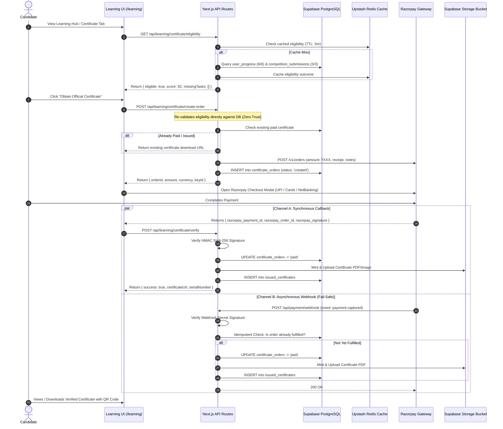
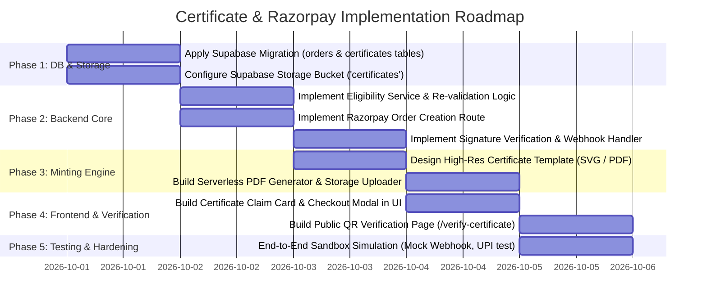

# ARCHITECTURAL PLAN: LEARNING CERTIFICATION ENGINE & RAZORPAY INTEGRATION

**Platform:** Qiskit Fall Fest 2026 — SRM University-AP × IBM Quantum  
**Module:** Online Masterclass Learning Phase Certification & Payment Gateway  
**Document Status:** Master Implementation Architecture Plan  
**Target File Path:** [`docs/plan.md`](./plan.md)  
**Target Framework:** Next.js 15 (App Router) + Supabase (PostgreSQL 17) + Upstash Redis + Razorpay API  

---

## 1. Executive Summary & Objective

The Qiskit Fall Fest 2026 Online Learning Phase provides 6 progressive masterclass sessions (across 3 days) and 3 daily creative competitions. To ensure academic rigor and institutional value for IBM Quantum & SRM University-AP credentials:

1. **Eligibility Enforcement:** Certificates are strictly **non-purchasable without full completion**. Candidates must have completed 100% of the learning arc (all 6 video sessions watched + all 6 concept check quizzes passed) and submitted all 3 daily competition challenges.
2. **Server-Side Gatekeeping:** The payment step cannot be initiated unless the backend independently verifies that the candidate has met all academic criteria in the database.
3. **Robust Payment & Minting Lifecycle:** Powered by **Razorpay** with dual-channel verification (synchronous client callback + asynchronous HMAC-SHA256 signed webhooks), idempotent order creation, database transactions, automated PDF/SVG certificate generation, and persistent CDN storage on Supabase Storage.

---

## 2. High-Level Architecture Flow



---

## 3. Academic Eligibility Engine

### 3.1 Completion Criteria Matrix
A candidate is marked `isEligible = true` only when **all** of the following database criteria are satisfied:

| Requirement Area | Table Source | Validation Rule | Purpose |
| :--- | :--- | :--- | :--- |
| **Masterclass Lectures** | `public.user_progress` | Exactly 6 unique session records where `video_completed = true`. | Verifies attendance of all 6 curriculum sessions. |
| **Concept Quizzes** | `public.user_progress` | Exactly 6 unique session records where `quiz_passed = true` with `quiz_score >= passingScore` (75%). | Verifies conceptual comprehension and foundational mastery. |
| **Creative Competitions** | `public.competition_submissions` | Exactly 3 unique records covering types `'reels'`, `'poster'`, and `'essay'` where `submission_url IS NOT NULL`. | Verifies completion of daily hands-on application challenges. |
| **Active Whitelist** | `public.allowed_emails` | User email exists and `is_active = true`. | Verifies user is an authorized participant. |

### 3.2 Anti-Tamper & Fraud Prevention Directives
* **Zero Client-Side Trust:** The frontend UI must never pass flags like `isEligible: true` or `price: 499` to the backend.
* **Server-Side Re-validation:** When `/api/learning/certificate/create-order` is called, the server independently queries `user_progress` and `competition_submissions` inside a transaction. If any condition is unmet, it returns `403 Forbidden` with a detailed list of missing requirements.
* **Price Tampering Defense:** The price is hardcoded on the server (or pulled from an admin configuration table in Supabase), never accepted from the request payload.

---

## 4. Database Schema Design (Supabase Migration)

Create a dedicated migration file: `supabase/migrations/20260930000000_create_certificate_and_payments.sql`.

```sql
-- 1. Certificate Order Lifecycle Table
CREATE TABLE IF NOT EXISTS public.certificate_orders (
    id UUID PRIMARY KEY DEFAULT gen_random_uuid(),
    user_email TEXT NOT NULL REFERENCES public.allowed_emails(email) ON DELETE CASCADE,
    razorpay_order_id TEXT UNIQUE NOT NULL,
    razorpay_payment_id TEXT UNIQUE,
    razorpay_signature TEXT,
    amount_paise INTEGER NOT NULL, -- e.g., 49900 = INR 499.00
    currency TEXT DEFAULT 'INR' NOT NULL,
    status TEXT NOT NULL DEFAULT 'created' CHECK (status IN ('created', 'attempted', 'paid', 'failed', 'refunded')),
    idempotency_key TEXT UNIQUE,
    metadata JSONB DEFAULT '{}'::jsonb,
    created_at TIMESTAMPTZ DEFAULT now() NOT NULL,
    updated_at TIMESTAMPTZ DEFAULT now() NOT NULL
);

-- Index for high-speed email lookups
CREATE INDEX IF NOT EXISTS idx_cert_orders_email ON public.certificate_orders(user_email);
CREATE INDEX IF NOT EXISTS idx_cert_orders_rzp_id ON public.certificate_orders(razorpay_order_id);

-- 2. Official Issued Certificates Table
CREATE TABLE IF NOT EXISTS public.issued_certificates (
    id UUID PRIMARY KEY DEFAULT gen_random_uuid(),
    serial_number TEXT UNIQUE NOT NULL, -- Format: QFF26-CERT-YYYYMM-XXXX
    user_email TEXT NOT NULL REFERENCES public.allowed_emails(email) ON DELETE CASCADE,
    recipient_name TEXT NOT NULL,
    institution TEXT DEFAULT 'SRM University-AP',
    course_name TEXT DEFAULT 'IBM Quantum Masterclass: A Decade of Quantum on Cloud' NOT NULL,
    order_id UUID REFERENCES public.certificate_orders(id),
    average_quiz_score NUMERIC(5, 2) NOT NULL,
    certificate_url TEXT NOT NULL, -- Public CDN link in Supabase Storage
    verification_hash TEXT UNIQUE NOT NULL, -- SHA-256 for public tamper verification
    issued_at TIMESTAMPTZ DEFAULT now() NOT NULL,
    
    -- Enforce single certificate per recipient per program
    CONSTRAINT unique_user_certificate UNIQUE (user_email, course_name)
);

CREATE INDEX IF NOT EXISTS idx_issued_certs_serial ON public.issued_certificates(serial_number);
CREATE INDEX IF NOT EXISTS idx_issued_certs_email ON public.issued_certificates(user_email);

-- 3. Row Level Security Policies
ALTER TABLE public.certificate_orders ENABLE ROW LEVEL SECURITY;
ALTER TABLE public.issued_certificates ENABLE ROW LEVEL SECURITY;

-- Users can read their own orders and certificates
CREATE POLICY "Users view own certificate orders" 
ON public.certificate_orders FOR SELECT 
USING (auth.jwt() ->> 'email' = user_email);

CREATE POLICY "Users view own issued certificates" 
ON public.issued_certificates FOR SELECT 
USING (auth.jwt() ->> 'email' = user_email);

-- Public can verify any certificate via unique serial number (QR Code scanner support)
CREATE POLICY "Public verification by serial number" 
ON public.issued_certificates FOR SELECT 
USING (true);
```

---

## 5. Razorpay Integration & Fail-Safe Mechanics

### 5.1 Required Environment Variables
Add to [`.env.local`](../.env.local) (gitignored) and Vercel Environment Variables:

```env
# Razorpay Credentials
NEXT_PUBLIC_RAZORPAY_KEY_ID=rzp_live_xxxxxxxxxxxxxx   # Public Key for Client SDK
RAZORPAY_KEY_SECRET=xxxxxxxxxxxxxxxxxxxxxxxx         # Private Secret for HMAC Verification
RAZORPAY_WEBHOOK_SECRET=xxxxxxxxxxxxxxxxxxxx         # Webhook Signing Secret

# Certificate Pricing & Brand Configuration
CERTIFICATE_PRICE_INR=499                            # Amount in INR (Base currency)
NEXT_PUBLIC_SITE_URL=https://www.qffsrmap2026.com
```

### 5.2 Dual-Channel Verification Matrix (Fail-Safe Architecture)

Why both channels are required:
* **The Problem:** If a user pays successfully in UPI or Google Pay on their phone, but closes the browser before redirecting back, a client-only verification (`/api/verify`) will **never fire**, leaving the user charged with no certificate issued.
* **The Solution:** Dual-Channel Execution with strict **Database Idempotency**:

| Channel | Trigger | Responsibility | Idempotency Safeguard |
| :--- | :--- | :--- | :--- |
| **Channel A (Client Sync)** | Razorpay Modal `handler(response)` | Instant UI feedback. User sees confetti, certificate preview, and download button without waiting. | Checks if certificate is already minted; if so, returns existing URL immediately. |
| **Channel B (Server Webhook)** | Razorpay `payment.captured` event | Background safety net. If Channel A failed or was aborted by user closing tab, Channel B mints the certificate and sends email. | Uses PostgreSQL transaction with `SELECT ... FOR UPDATE` or `ON CONFLICT DO NOTHING`. |
| **Channel C (Reconciliation)** | Admin / Scheduled Cron | Periodic audit of any `certificate_orders` stuck in `'created'` status past 30 minutes, checking Razorpay REST API directly. | Reconciles discrepancies automatically. |

### 5.3 Cryptographic Signature Verification
Razorpay signatures use HMAC-SHA256:
$$\text{Expected Signature} = \text{HMAC-SHA256}(\text{order\_id} + \text{"|"} + \text{payment\_id}, \text{RAZORPAY\_KEY\_SECRET})$$

```typescript
import crypto from 'crypto';

export function verifyRazorpaySignature(
  orderId: string,
  paymentId: string,
  signature: string
): boolean {
  const generatedSignature = crypto
    .createHmac('sha256', process.env.RAZORPAY_KEY_SECRET!)
    .update(`${orderId}|${paymentId}`)
    .digest('hex');

  return crypto.timingSafeEqual(
    Buffer.from(generatedSignature),
    Buffer.from(signature)
  );
}
```

---

## 6. Certificate Minting & Storage Engine

### 6.1 Certificate Specification
* **Dimensions:** Standard Landscape A4 / 16:9 High-DPI (`1920x1080` or `3508x2480` at 300 DPI).
* **Branding:** Official dual-lobed IBM Quantum Fall Fest 2026 insignia, SRM University-AP crest, and "A Decade of Quantum on Cloud" milestone emblem.
* **Dynamic Credentials Rendered:**
  - Recipient Full Name (from user whitelist/profile).
  - Unique Serial Number: `QFF26-MCL-202610-[HASH]`.
  - Issue Date: `10 October 2026` (or dynamic completion date).
  - Academic Distinction: Average Quiz Score (e.g., *Passed with Distinction: 94%*).
  - Dynamic QR Code linking directly to public verification URL: `https://www.qffsrmap2026.com/verify-certificate/[serial]`.
  - Authorized Signatories: Faculty Coordinator (SRM-AP) and IBM Quantum Principal Educator.

### 6.2 Storage Provisioning (Supabase Storage)
* **Bucket Name:** `certificates`
* **Visibility:** Public read access via CDN (`public: true`).
* **Path Strategy:** `certificates/masterclass/2026/{serial_number}.pdf` and `{serial_number}.png`.
* **Caching:** Cache-Control headers set to `public, max-age=31536000, immutable` (certificates are immutable once minted).

---

## 7. Frontend User Experience & UI Placement

### 7.1 Location in `/learning` Portal
1. **Sidebar Navigation:** Add a dedicated **"Certificate & Credentials"** item to the Learning sidebar with real-time status badges:
   - `Locked (0/6 Sessions, 0/3 Tasks)`
   - `In Progress (4/6 Sessions, 2/3 Tasks)`
   - `Eligible & Ready for Minting`
   - `Issued & Verified`
2. **Dedicated Certificate Modal / Tab:**
   - **Progress Checklist:** Clear visual indicators for each session and daily task.
   - **Preview Watermark:** A watermarked sample certificate with the student's name to increase engagement.
   - **Transparent Pricing Card:** Clearly states what is included (Official Verified Credential, Verifiable QR URL, High-Res Vector PDF, Permanent Cloud Record).
   - **Razorpay Checkout Trigger:** Native responsive modal supporting direct UPI apps (GPay, PhonePe, Paytm).

---

## 8. Implementation Phasing & Work Breakdown



---

## 9. Security & Compliance Checklist

- [ ] **No Client-Supplied Amounts:** The order amount is computed exclusively on the server using environment configuration.
- [ ] **Timing-Safe Equality Checks:** Verification uses `crypto.timingSafeEqual` to eliminate timing attack vulnerabilities on HMAC validation.
- [ ] **Idempotent Webhook Processing:** Webhooks can be triggered multiple times by Razorpay retries without issuing duplicate certificates or charging twice.
- [ ] **Zero Hardcoded Secrets in Git:** `RAZORPAY_KEY_SECRET` and `RAZORPAY_WEBHOOK_SECRET` are strictly kept in `.env.local` and Vercel secrets.
- [ ] **Public Verification Without Data Leakage:** The public verification endpoint (`/verify-certificate/[serial]`) displays only Name, Serial, Course, and Issue Date—never personal emails or payment IDs.
